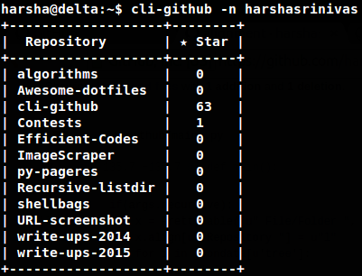
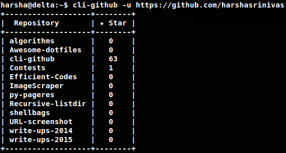
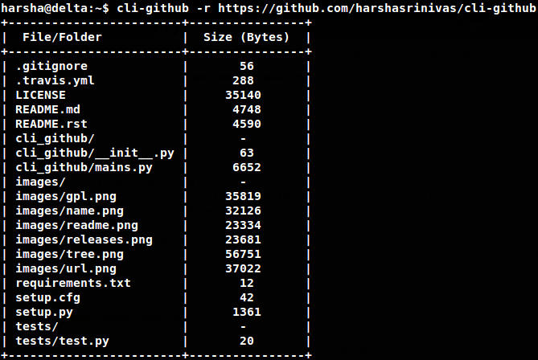
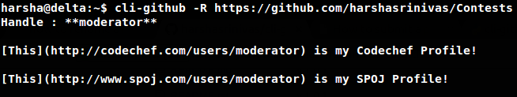

#`clipy-github`

A Python App to display **Github from the command-line**

#Screenshots

`To fetch repos and stars using the username`



`To fetch repos and stars using the profile URL`



`To get all the files and folders within a repo from its link`



`To get the RAW version of readme file from the repo link`




#Installation

##Using `pip`

`pip3 install clipy_github`

##From the Source

* Clone the repo `git clone https://github.com/harshasrinivas/clipy-github.git`
* Run `python3 setup.py install`

##Dependencies

* prettytable `pip3 install prettytable`


#Setting Up

**Github Token as Temporary Environment Variable**

`$ GITHUB_TOKEN = <your-token-within-quotes>`

**Github Token as Permanent Environment Variable**

`$ echo "export GITHUB_TOKEN = <your-token-within-quotes>" | sudo tee -a /etc/environment`

**Without saving your Environment Variable**

Open the `clipy_github/mains.py` file

Change this line `API_TOKEN = os.environ.get('GITHUB_TOKEN')` to `API_TOKEN = <your-token-within-quotes> `

<br>

#Options

```sh
-h, --help            show this help message and exit
-n USERNAME, --username USERNAME
                    Get the list of repositories of the given username
-u URL, --url URL 
                    Get repos from the user profile URL
-r RECURSIVE, --recursive RECURSIVE
                    Get the file structure from the repo link URL
-R README, --readme README
                    Get the raw version of the repository readme file from repo link URL
```


#Usage

Display the list of a user's repositories from the username, along with the number of stargazers

`$ clipy-github -n harshasrinivas`

Display the list of a user's repositories from the profile URL, along with the number of stargazers

`$ clipy-github -u https://github.com/harshasrinivas`

Display all the files and folders within a repository recursively from the repository URL, along with their sizes

`$ clipy-github -r https://github.com/harshasrinivas/clipy-github`

Get the RAW version of the readme file of a repository from the repository URL

`$ clipy-github -R https://github.com/harshasrinivas/clipy-github`


#Live Demo

[**DEMO**](http://showterm.io/72aa0ffb05765f7ec92c0#fast) : Display the list of a user's repositories from the username, along with the number of stargazers

[**DEMO**](http://showterm.io/813bc4e61fc9d752d2cb6#fast) : Display the list of a user's repositories from the profile URL, along with the number of stargazers

[**DEMO**](http://showterm.io/459287d10701d531f3506#fast) : Display all the folders and files within a repository recursively from the repository URL, along with their sizes

[**DEMO**](http://showterm.io/09286d1d9b333be0cc9cd#fast) : To get the RAW version of the readme file of a repository from the repository URL


#Contribute

If you want to add features, improve them, or report issues, feel free to send a pull request.


#License


